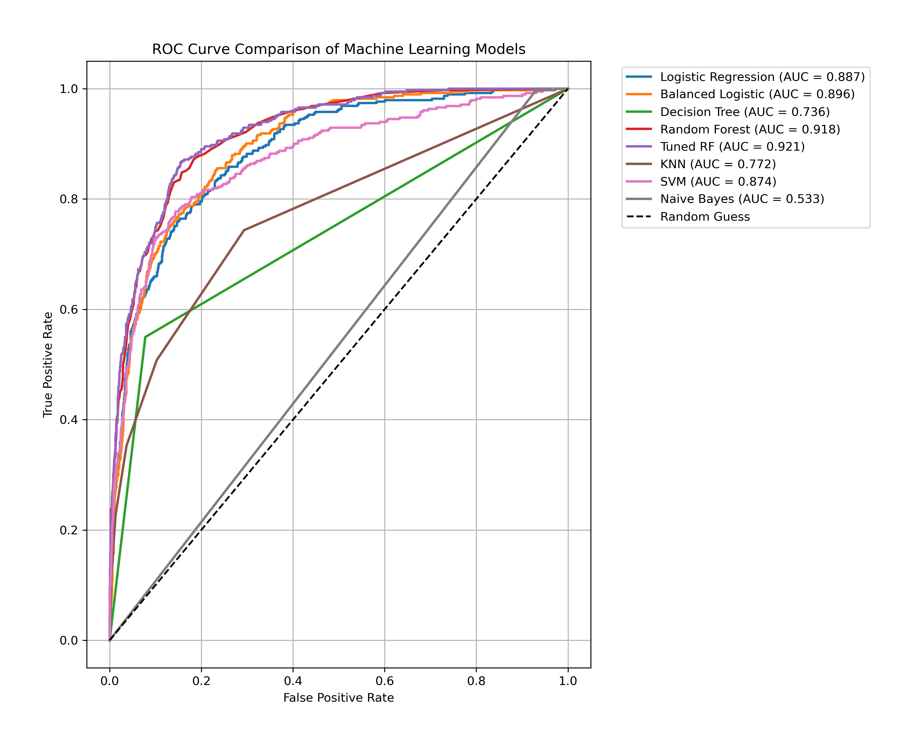
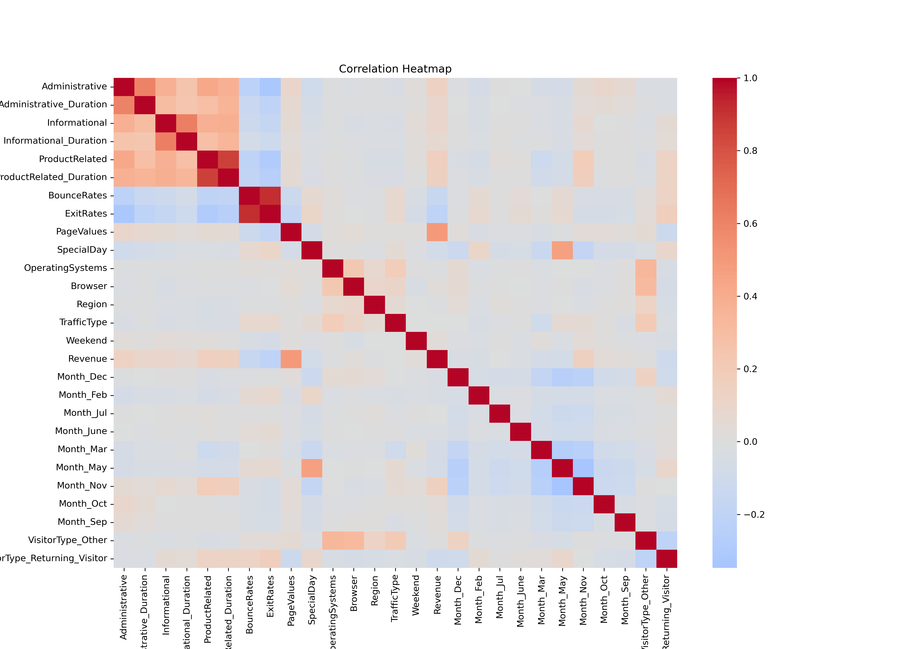
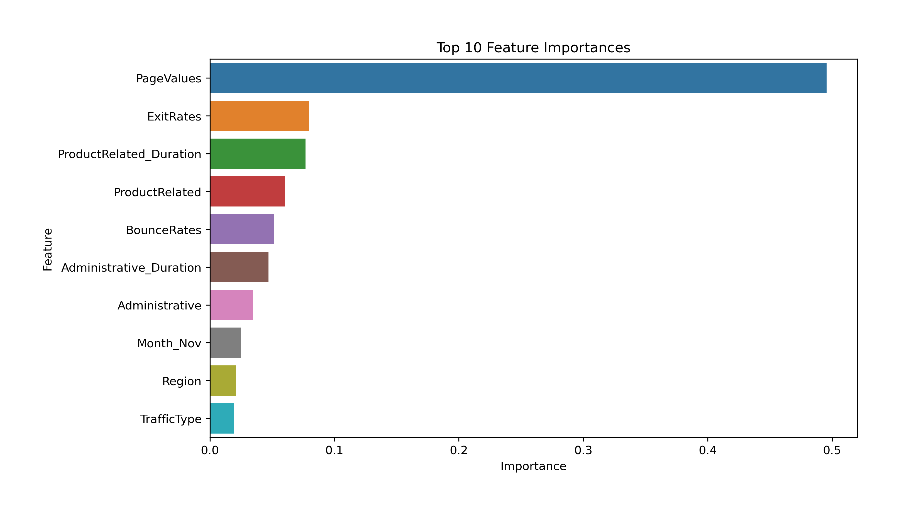
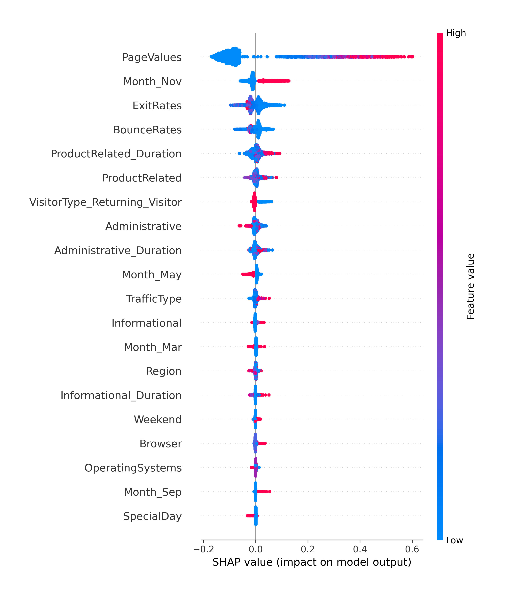
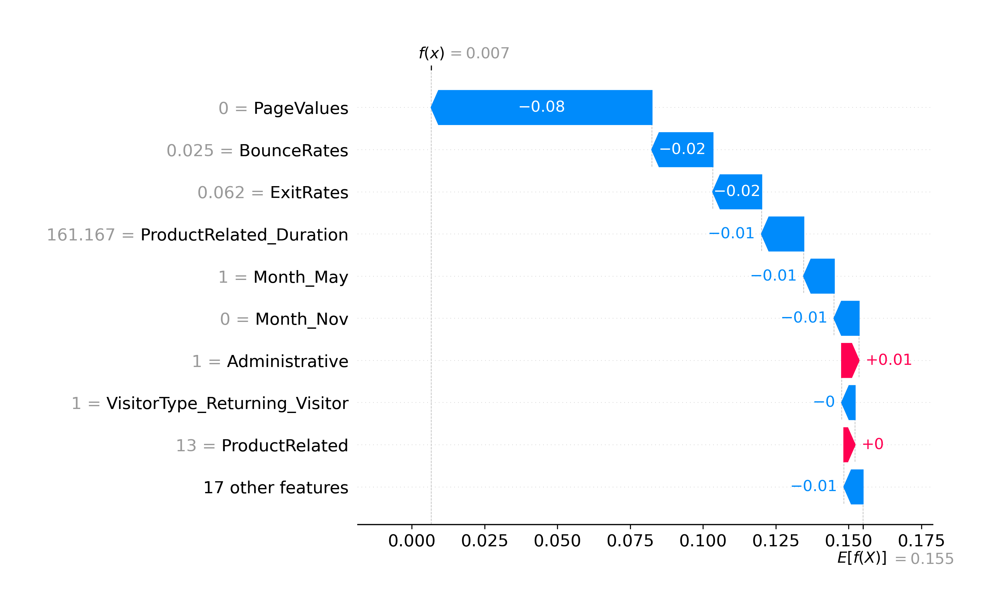

# 🛒 Online Shopper Purchase Prediction using Machine Learning

## 📌 Project Overview

This project predicts whether an online visitor will complete a purchase based on their browsing behaviour. Multiple machine learning classification algorithms were implemented, evaluated, and compared to identify the best-performing model. The final model was further interpreted using SHAP (SHapley Additive exPlanations) to provide explainable AI insights.

---

## 🎯 Objectives

- Predict online customer purchase intention.
- Compare multiple machine learning algorithms.
- Improve model performance through hyperparameter tuning.
- Interpret model predictions using SHAP.
- Identify the most influential features affecting customer purchases.

---

## 📊 Dataset

**Dataset:** Online Shoppers Purchasing Intention Dataset

**Target Variable**

- Revenue
  - True = Purchase
  - False = No Purchase

**Key Features**

- Administrative
- Informational
- ProductRelated
- BounceRates
- ExitRates
- PageValues
- VisitorType
- Month
- Weekend

---

## 🤖 Machine Learning Models

- Logistic Regression
- Balanced Logistic Regression
- Decision Tree
- Random Forest
- Tuned Random Forest
- K-Nearest Neighbours (KNN)
- Support Vector Machine (SVM)
- Gaussian Naive Bayes

---

## 🏆 Best Model

The **Tuned Random Forest** achieved the best overall performance.

| Metric | Score |
|--------|------:|
| Accuracy | 90.15% |
| Precision | 74.91% |
| Recall | 54.71% |
| F1-score | 63.24% |
| ROC-AUC | 92.08% |

---

## 📈 Model Comparison

| Model | Accuracy | Precision | Recall | F1-score | ROC-AUC |
|-------|---------:|----------:|--------:|---------:|---------:|
| Logistic Regression | 88.12% | 74.32% | 35.60% | 48.14% | 88.72% |
| Balanced Logistic Regression | 85.00% | 51.07% | 74.87% | 60.72% | 89.62% |
| Decision Tree | 86.46% | 56.45% | 54.97% | 55.70% | 73.60% |
| Random Forest | 89.78% | 73.21% | 53.66% | 61.93% | 91.79% |
| Tuned Random Forest | **90.15%** | **74.91%** | **54.71%** | **63.24%** | **92.08%** |
| K-Nearest Neighbours | 88.44% | 70.12% | 44.24% | 54.25% | 87.36% |
| Support Vector Machine | 86.86% | 63.68% | 35.34% | 45.45% | 77.25% |
| Gaussian Naive Bayes | 67.64% | 29.77% | 80.10% | 43.40% | 79.74% |

---

## 🔥 Visualisations

### ROC Curve

---

### Correlation Heatmap

---

### Feature Importance

---

### SHAP Summary Plot

---

### SHAP Waterfall Plot

---

## 🛠 Technologies Used

- Python
- Pandas
- NumPy
- Matplotlib
- Scikit-learn
- SHAP
- Jupyter Notebook

---

## 🚀 Future Improvements

- Evaluate XGBoost and LightGBM models.
- Deploy the model using Streamlit or Flask.
- Perform cross-validation and threshold optimization.
- Build a real-time customer purchase prediction dashboard.

---

## 👩‍💻 Author

**Kazi Kaniz Fatema**

GitHub:
https://github.com/KaziKanizFatema
